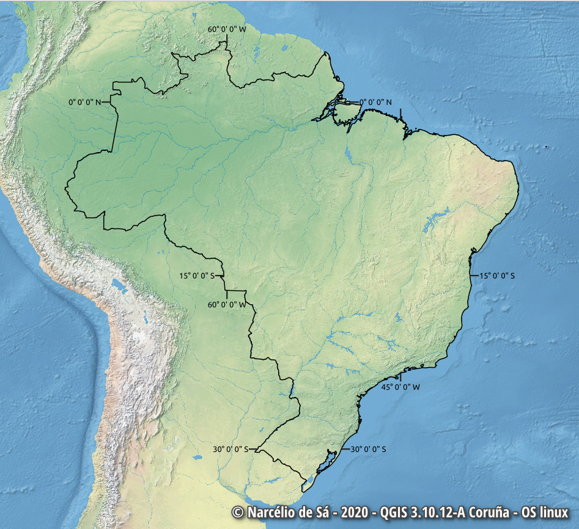
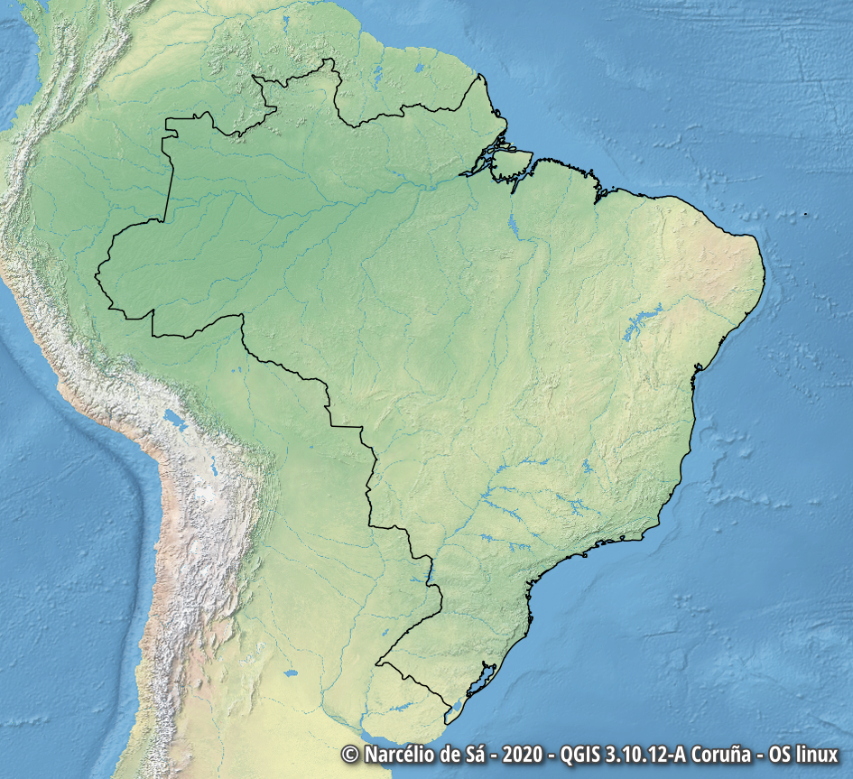
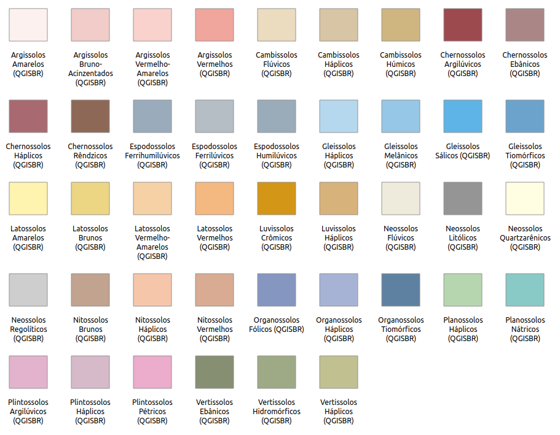
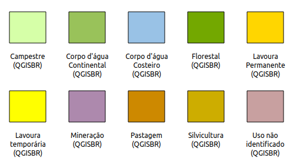

# QGISBR Sharing Resources

This repository contains styles, scripts, models, and other QGIS 
resources that you can share through the [QGIS Resources Sharing](https://plugins.qgis.org/plugins/qgis_resource_sharing/).

## Collections

[**Grid Polygon**](https://github.com/qgisbr/QGISBR-Resources/tree/main/collections/grid_polygon): Creates a grid of coordinates around a selected feature!

[**Simbologias do Sistema Brasileiro de Classificação de Solos**](https://github.com/qgisbr/QGISBR-Resources/tree/main/collections/classificacao_solos_embrapa): Simbologias usadas para a confecção de mapas/cartas de solos, com o emprego do Sistema Brasileiro de Classificação de Solos. As cores foram estabelecidas em consonância com o que já vem sendo praticado há muito, pela Embrapa Solos e outras instituições, e estão definidas até o nível de Subordens.

[**Simbologias do Sistema de Classificação de Uso da Terra - SCUT**](https://github.com/qgisbr/QGISBR-Resources/tree/main/collections/sistema_classificacao_uso_terra_scut): Simbologias das classes da cobertura e uso da terra Níveis I e II do Sistema de Classificação de Uso da Terra - SCUT 

[**Simbologias para mapeamento geológico do Serviço Geológico do Brasil – CPRM**](https://github.com/qgisbr/QGISBR-Resources/tree/main/collections/geologia_cprm): Simbologias para mapeamento geológico do Serviço Geológico do Brasil –  CPRM

